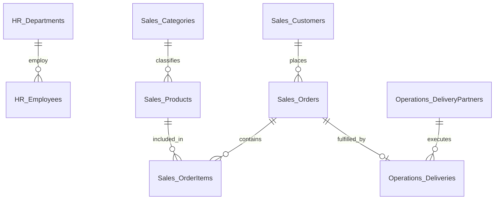

# InsightX Corp — SQL Analytics & Business Intelligence

> Enterprise-style SQL Server analytics project focused on customer behavior, sales performance, product analytics, transactions, and operational insights.

---

## 📌 Project Overview

**InsightX Corp** is a simulated enterprise analytics environment built using **Microsoft SQL Server** and **T-SQL**.

The project is designed to demonstrate practical SQL development and analytical problem-solving using realistic business data.

The database contains multiple business domains, including:
* Customer analytics
* Product management
* Sales and purchasing
* Order operations
* Employee analytics
* Transaction activity
* User engagement

The project combines database development, data quality analysis, business questions, and SQL interview preparation into a single portfolio project.

---

## 🎯 Project Objectives

The primary objectives of this project are to:
* Build a structured relational database using SQL Server
* Design realistic business datasets
* Practice SQL from foundational to advanced concepts
* Solve real-world analytical problems
* Identify and investigate data-quality issues
* Develop efficient and readable T-SQL queries
* Document the database and analytical processes
* Demonstrate SQL capabilities through a public portfolio project

---

## 🏢 Business Context

InsightX Corp operates across several digital business areas and generates data from customers, products, sales, transactions, employees, and operational activities.

The analytics team uses SQL Server to answer business questions such as:
1. Which customers are consistently purchasing throughout the year?
2. Which products are the most expensive within each category?
3. Are there products being sold that are missing from the product master?
4. Which employees have matching salaries within their departments?
5. Which users are highly active across different days of the week?
6. Which products are performing above their category average?
7. Which delivery partners have the highest number of delayed orders?

These questions form the basis of the analytical exercises in this project.

---

## 🛠️ Technology Stack

| Technology | Purpose |
| :--- | :--- |
| **Microsoft SQL Server** | Relational database engine |
| **SQL Server Express** | Local database environment |
| **SQL Server Management Studio (SSMS)** | Database development and query execution |
| **T-SQL** | Data manipulation and analysis |
| **GitHub** | Version control and project documentation |

---

## 🗄️ Database Domains & Schemas

The InsightX Corp database (`InsightXDb`) is organized around several core business domains across 4 schemas:

* **Sales Schema:** Contains customer profiles, product catalog, categories, orders, and line items.
* **HR Schema:** Contains employee records, hiring dates, compensation, and departmental structures.
* **Operations Schema:** Contains delivery logistics, delivery partners, promised dates, and fulfillment dates.
* **Mobility Schema:** Contains user activity tracking, engagement logs, and financial transaction records.

### Entity-Relationship Diagram (ERD)


---

## 📊 Analytical Areas

The project covers six key analytical domains:

* **Customer Analytics:** Purchase frequency, quarterly purchasing behavior, customer retention, and user engagement.
* **Product Analytics:** Product pricing hierarchy, category performance, missing product detection, and above-average pricing models.
* **Sales Analytics:** Sales volume, quarterly revenue trends, product performance, and basket analysis.
* **Operations Analytics:** Order delivery SLA performance, delivery partner delay percentages, and fulfillment tracking.
* **Employee Analytics:** Department-level salary analysis, internal pay equity audits, and duplicate compensation flagging.
* **Transaction Analytics:** Chronological transaction sequencing (3rd transaction milestone), user spending habits, and activity patterns.

---

## 🧠 SQL Skills Demonstrated

### Foundations
* `SELECT`, `WHERE`, `ORDER BY`, `DISTINCT`, `TOP`
* Aggregate functions (`SUM`, `AVG`, `COUNT`, `MIN`, `MAX`)
* `GROUP BY` and `HAVING` filtering
* Date aggregations (`DATEPART`, `YEAR`, `SET DATEFIRST`)

### Intermediate SQL
* Joins: `INNER JOIN`, `LEFT JOIN` (Anti-joins for data auditing)
* Conditional Logic: `CASE WHEN ... THEN ... ELSE ... END`
* String Functions: `TRIM()`, `CHARINDEX()`, `SUBSTRING()`, `UPPER()`, `LOWER()`
* Data Type Conversion: `CAST()` and `CONVERT()`

### Advanced SQL
* **Common Table Expressions (CTEs):** Modularizing complex multi-step transformations.
* **Window Functions:** `ROW_NUMBER()`, `RANK()`, `DENSE_RANK()`, `AVG() OVER (PARTITION BY ...)`
* **Conditional Aggregation:** SLA tracking rates and binary counts inside aggregations.

### Data Quality & Auditing
* Identifying missing records (`NULL` values)
* Detecting Foreign Key violations and unmapped catalog records
* Standardizing irregular customer text inputs
* Auditing salary duplicates within departments

---

## 📁 Project Structure

```text
insightx_corp/
│
├── README.md                          <-- Root Main Documentation
│
├── database/
│   ├── 01_database_setup.sql          <-- Database & Schema Creation (InsightXDb)
│   ├── 02_schema_and_tables.sql       <-- DDL: Tables, Foreign Keys & Constraints
│   └── 03_sample_data.sql             <-- DML: Mock Data Seed Script
│
├── interview_questions/
│   ├── 01_customer_quarterly_purchases.sql
│   ├── 02_most_expensive_products.sql
│   ├── 03_missing_products.sql
│   ├── 04_same_salary_department.sql
│   ├── 05_third_transaction.sql
│   ├── 06_delayed_orders.sql
│   ├── 07_standardize_names.sql
│   ├── 08_quarterly_customers.sql
│   ├── 09_weekday_weekend_users.sql
│   └── 10_above_category_average.sql
│
└── solutions/
    └── README.md                      <-- Comprehensive Solutions Summary & Expected Outputs ```

---

## 🔍 Interview SQL Challenges Summary

The project includes a dedicated set of 10 interview-style SQL problems:

1. **Customers Purchasing in Every Quarter:** Identify loyal customers active across Q1–Q4 2025.
2. **Most Expensive Products by Category:** Find top-priced items per category using `DENSE_RANK()`.
3. **Missing / Unmapped Products:** Audit line items for missing (`NULL`) or unmapped catalog IDs.
4. **Employees Sharing Salaries in Same Department:** Flag identical salary pairs in HR using `COUNT() OVER()`.
5. **Third Transaction Per User:** Isolate each user's exact 3rd chronological transaction.
6. **Delayed Orders by Delivery Partner:** Calculate SLA delay percentages by logistics vendor.
7. **Standardizing Customer Names:** Format raw, irregular name strings into standard Title Case.
8. **Quarterly Customer Purchasing Trends:** Executive rollup of quarterly revenue and average order value.
9. **Weekday vs. Weekend Active Users:** Detect power users logging activity on both weekdays and weekends.
10. **Products Performing Above Category Average:** Identify products priced above category mean with delta calculations.

> *👉 For complete T-SQL queries and expected output tables, see the [`/solutions/README.md`](./solutions/README.md) file.*

---

## 📈 Project Development Roadmap

```text
Phase 1 — Project Foundation
  └─ Define business context & schema architecture
Phase 2 — Database Development
  └─ Execute DDL scripts in SSMS to build tables & relationships
Phase 3 — Data Quality & Seeding
  └─ Load seed dataset including realistic data edge-cases
Phase 4 — SQL Solutions & Analytics
  └─ Write production-grade queries for all 10 interview challenges
Phase 5 — Portfolio Finalization
  └─ Document architecture, ERD, solutions matrix, and push to GitHub


